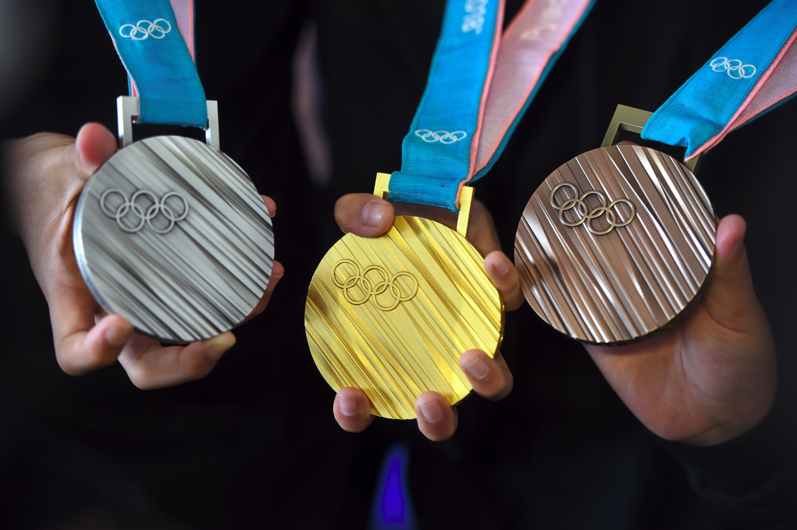

# Who-would-win-the-Olympics

# Project Overview

This is my side project inspired by a course from my school. This is the first time I worked with Pandas, Matplotlib, Scikit Learn and many machine learning algorithms.

My project aims to train a model predicting an athlete would get which medals based on his physical chacteristics.
In my project, I tried different models and ways of preprocessing data in order to find out the best combination.

# Data Description
Data used in the project can be found here https://www.kaggle.com/heesoo37/120-years-of-olympic-history-athletes-and-results.

There are 2 raw datasets in csv type. They contains information of characteristics and results of individual athletes competing in individual Olympics event.

More information about the data can be found in the link below. 

# What I have learned
* End-to-end process of a machine learning project  
* Basic skills of Pandas, Matplotlib and Scikit Learn  
* Machine learning algorithms implemented in Scikit Learn  
